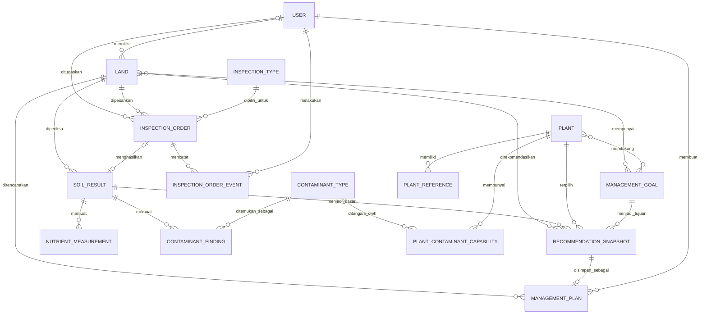

# ERD Wiji

Diagram ini menjadi acuan awal hubungan data utama Wiji untuk memulai development. Jika kebutuhan implementasi berubah, relasi dapat diperbarui bersama melalui pull request.

## Kepemilikan Model

| Bagian | Model yang Dimiliki |
|---|---|
| Akun dan fitur bersama | `User` dan role pengguna |
| Modul A — Manajemen Lahan | `Land`, `ManagementGoal` |
| Modul B — Pemesanan Pemeriksaan | `InspectionType`, `InspectionOrder`, `InspectionOrderEvent` |
| Modul C — Hasil Pemeriksaan | `SoilResult`, `NutrientMeasurement`, `ContaminantFinding` |
| Modul D — Katalog Tanaman | `Plant`, `PlantReference`, `ContaminantType`, `PlantContaminantCapability` |
| Modul E — Rekomendasi dan Rencana | `RecommendationSnapshot`, `ManagementPlan` |

## Hubungan Utama

- Satu pemilik dapat mempunyai banyak lahan.
- Satu lahan dapat mempunyai banyak pemesanan sepanjang waktu, tetapi hanya satu yang aktif pada saat yang sama.
- Satu pemesanan menghasilkan maksimal satu hasil pemeriksaan.
- Hasil mandiri tetap terhubung ke lahan, tetapi tidak harus mempunyai pemesanan.
- Satu hasil dapat memiliki beberapa pengukuran unsur hara dan temuan kontaminan.
- Satu tanaman dapat mendukung beberapa tujuan pengelolaan.
- Kemampuan fitoremediasi menghubungkan tanaman dengan jenis kontaminan tertentu.
- Satu snapshot rekomendasi memakai satu lahan, hasil pemeriksaan, tujuan utama, dan tanaman.
- Satu snapshot dapat disimpan menjadi maksimal satu rencana pengelolaan.
- `ContaminantType` dimiliki Modul D dan digunakan Modul C sebagai data referensi.
- `InspectionOrder` tidak menyimpan pemilik secara langsung. Pemilik pesanan dibaca dari `Land.owner`, sedangkan relasi ke `User` di pesanan adalah petugas yang ditugaskan.
- `InspectionOrder` menyimpan jadwal usulan (tanggal dan sesi dari pemilik) dan jadwal final (dari admin, kosong sampai `Dijadwalkan`).
- Setiap perubahan penting pada pesanan dicatat sebagai satu `InspectionOrderEvent`: perubahan status, penjadwalan ulang, dan pergantian petugas. Event menyimpan status sebelum dan sesudah, pelaku, catatan atau alasan, serta waktunya. Untuk penjadwalan ulang, event juga menyimpan tanggal lama dan baru.
- `InspectionType` dikelola admin dan diisi awal dengan tiga jenis bertingkat: Dasar, Unsur Hara, dan Kontaminan. Jenis ini menentukan data wajib saat Modul C memfinalkan hasil.
- Modul C tidak mengubah status pesanan secara langsung. Saat hasil difinalkan, Modul C memanggil fungsi transisi Modul B untuk mengubah pesanan dari `Diproses` ke `Selesai`.
- Data yang sudah mempunyai riwayat atau relasi penting diarsipkan dan tidak dihapus permanen.
