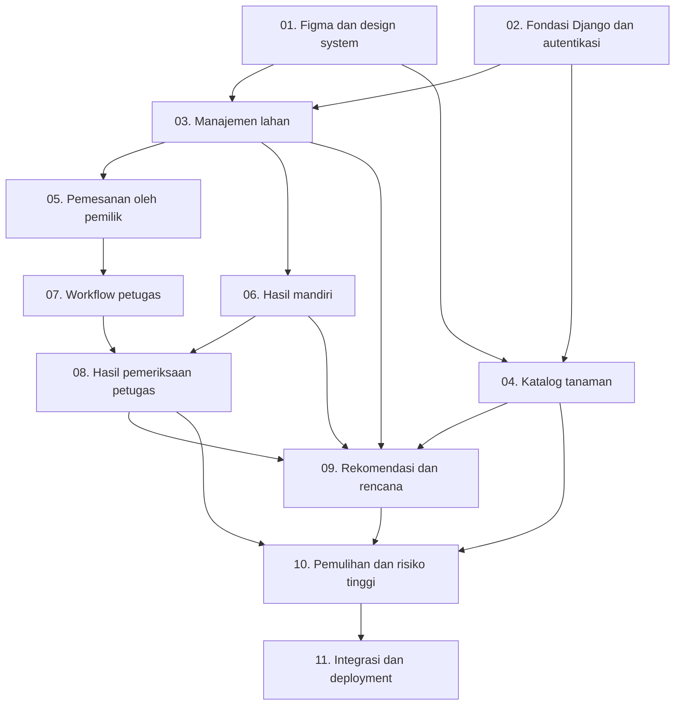

# Rencana Kerja Wiji

Dokumen ini membagi pekerjaan Wiji menjadi bagian yang jelas supaya setiap anggota tahu apa yang harus dibuat, kapan bisa mulai, dan kapan pekerjaannya dianggap selesai.

Acuan bersama:

- [Istilah dan arah produk](./DOMAIN.md)
- [ERD awal](./ERD.md)

## Pembagian Modul

| Modul | Penanggung Jawab | Fokus |
|---|---|---|
| A — Manajemen Lahan | Rania Fauziah Nur Wahyudi | Data lahan dan lokasi |
| B — Pemesanan Pemeriksaan | Muhammad Osman Fardin | Pemesanan, jadwal, petugas, dan status |
| C — Hasil Pemeriksaan | Nadya Sekar Kayrana | Hasil mandiri dan hasil dari petugas |
| D — Katalog Tanaman | Yosua Peitho Purba | Data tanaman, sumber, dan kemampuan tanaman |
| E — Rekomendasi dan Rencana | Piedra Ridwan Azra Pulungan | Skor rekomendasi dan rencana pengelolaan |

Selain lima modul tersebut, kelompok perlu menentukan tiga peran bersama:

- **Koordinator desain:** menjaga Figma dan tampilan tetap konsisten.
- **Integrator:** menjaga fondasi Django dan membantu menyelesaikan konflik antarmodul.
- **Release owner:** memimpin pengecekan akhir dan deployment.

Satu orang boleh memegang lebih dari satu peran bersama. Peran ini tidak menggantikan tanggung jawab modul masing-masing.

## Urutan Pengerjaan



Pekerjaan yang tidak mempunyai hubungan langsung dapat berjalan paralel. Contohnya, katalog tanaman dapat dikerjakan bersamaan dengan manajemen lahan setelah fondasi bersama siap.

## 01 — Figma dan Design System

**Penanggung jawab:** Koordinator desain, dibantu seluruh anggota  
**Blocked by:** Tidak ada  
**Branch:** Tidak wajib jika hanya dikerjakan di Figma

### Yang Dibuat

Membuat alur tampilan utama dan aturan visual bersama agar setiap modul tidak mempunyai gaya sendiri-sendiri.

### Syarat Selesai

- [ ] Warna, tipografi, jarak, tombol, input, kartu, tabel, dan badge status sudah ditentukan.
- [ ] Ada tampilan desktop dan mobile untuk halaman utama.
- [ ] Ada desain landing page, login, registrasi, dan dashboard.
- [ ] Ada desain daftar, detail, dan formulir untuk setiap modul.
- [ ] Ada desain keadaan kosong, gagal, tidak berwenang, dan konfirmasi hapus atau batal.
- [ ] Seluruh anggota dapat membuka dan memahami file Figma.
- [ ] Tautan Figma siap dicantumkan di README.

## 02 — Fondasi Django dan Autentikasi

**Penanggung jawab:** Integrator  
**Blocked by:** Tidak ada  
**Branch:** `chore/project-foundation`

### Yang Dibuat

Menyiapkan proyek Django yang bisa dijalankan seluruh anggota, autentikasi dasar, role pengguna, layout bersama, dan konfigurasi pengembangan.

### Syarat Selesai

- [ ] Proyek dapat dijalankan dari instruksi README.
- [ ] Registrasi pemilik lahan, login, dan logout bekerja.
- [ ] Role pemilik dan petugas tersedia; admin menggunakan akun staf.
- [ ] Akun petugas hanya dapat dibuat atau ditentukan oleh admin.
- [ ] Base template, navbar, pesan, dan struktur CSS bersama tersedia.
- [ ] Nama app Django disepakati, misalnya `lands`, `inspections`, `soil_results`, `plants`, dan `recommendations`, dengan template di `<app>/templates/<app>/`.
- [ ] Konfigurasi sensitif tidak ditulis langsung dalam repository.
- [ ] `TIME_ZONE = "Asia/Jakarta"` dan `USE_TZ = True` sehingga aturan tanggal memakai waktu lokal.
- [ ] Pemeriksaan Django dan test fondasi lulus.
- [ ] Semua anggota berhasil menjalankan proyek di perangkat masing-masing.

## 03 — Manajemen Lahan dan Lokasi

**Penanggung jawab:** Rania Fauziah Nur Wahyudi  
**Modul:** A  
**Blocked by:** 01 dan 02  
**Branch:** `feat/land-management`

### Yang Dibuat

Pemilik dapat membuat, melihat, mengubah, dan mengarsipkan lahannya. Pencarian alamat menggunakan Nominatim dan menyimpan koordinat lahan.

### Syarat Selesai

- [ ] Lahan menyimpan nama, alamat, koordinat, luas, penggunaan, kondisi, foto, dan tujuan pengelolaan.
- [ ] Pemilik hanya dapat melihat dan mengubah lahannya sendiri.
- [ ] Pencarian alamat menggunakan Nominatim.
- [ ] Lahan dapat disimpan sebagai draf jika koordinat belum tersedia.
- [ ] Lahan tanpa riwayat dapat dihapus; lahan dengan riwayat hanya dapat diarsipkan.
- [ ] Lahan yang masih punya pesanan aktif tidak dapat diarsipkan.
- [ ] Tersedia daftar, detail, form tambah, form ubah, dan konfirmasi arsip atau hapus.
- [ ] Tersedia endpoint JSON dengan pemeriksaan kepemilikan.
- [ ] Ada filter atau interaksi AJAX/HTMX yang relevan.
- [ ] Tampilan responsif dan mengikuti Figma.
- [ ] Test CRUD, izin, keadaan kosong, dan kegagalan pencarian lokasi lulus.

## 04 — Katalog dan Data Awal Tanaman

**Penanggung jawab:** Yosua Peitho Purba  
**Modul:** D  
**Blocked by:** 01 dan 02  
**Branch:** `feat/plant-catalog`

### Yang Dibuat

Pengunjung dapat membaca katalog tanaman. Admin dapat mengelola tanaman, sumber informasi, tujuan yang didukung, serta kemampuan terhadap kontaminan.

### Syarat Selesai

- [ ] Katalog mempunyai sedikitnya 50 tanaman melalui fixture atau perintah seed.
- [ ] Data tanaman memuat nama lokal, nama ilmiah, deskripsi, kebutuhan tumbuh, manfaat, risiko, dan ketersediaan.
- [ ] Setiap klaim penting mempunyai sumber yang dapat dilacak.
- [ ] Kemampuan fitoremediasi menghubungkan tanaman dengan kontaminan tertentu.
- [ ] Katalog dapat dibaca publik.
- [ ] Operasi tambah, ubah, hapus, dan arsip hanya tersedia untuk staf.
- [ ] Tanaman yang sudah dipakai dalam rencana tidak dapat dihapus permanen.
- [ ] Tersedia pencarian dan filter katalog.
- [ ] Tersedia endpoint JSON dan interaksi AJAX/HTMX.
- [ ] Test akses publik, CRUD staf, filter, dan perlindungan data lulus.

## 05 — Pemesanan Pemeriksaan oleh Pemilik

**Penanggung jawab:** Muhammad Osman Fardin  
**Modul:** B  
**Blocked by:** 03  
**Branch:** `feat/inspection-ordering`

### Yang Dibuat

Pemilik dapat membuat pesanan untuk lahannya, melihat perkembangan pesanan, membatalkan, dan meminta penjadwalan ulang sebelum sampel diambil.

### Syarat Selesai

- [ ] Form pesanan memuat lahan, jenis pemeriksaan, tanggal dan sesi yang diajukan, serta catatan.
- [ ] Pemilik hanya dapat memilih lahan miliknya yang sudah berkoordinat dan tidak diarsipkan.
- [ ] Hanya jenis pemeriksaan aktif yang dapat dipilih; tiga jenis awal tersedia lewat seed.
- [ ] Tanggal usulan paling cepat besok dan paling lambat 30 hari ke depan.
- [ ] Pesanan baru mempunyai status `Diajukan`.
- [ ] Satu lahan hanya dapat mempunyai satu pesanan aktif (status selain `Selesai` dan `Dibatalkan`).
- [ ] Pemilik dapat melihat daftar dan detail pesanannya.
- [ ] Pemilik dapat mengubah tanggal usulan dan catatan selama status masih `Diajukan`.
- [ ] Pemilik dapat membatalkan dengan alasan selama status `Diajukan`, `Dikonfirmasi`, atau `Dijadwalkan`.
- [ ] Pemilik dapat meminta penjadwalan ulang dengan alasan selama status `Dikonfirmasi` atau `Dijadwalkan`; jadwal usulan diganti dan jadwal final dikosongkan.
- [ ] Pesanan tidak dihapus permanen; pembatalan menjadi *soft delete*.
- [ ] Detail pesanan menampilkan linimasa riwayat status.
- [ ] Tersedia endpoint JSON `GET/POST /inspections/api/orders/`, `GET .../<id>/`, serta aksi `.../<id>/cancel/` dan `.../<id>/reschedule/` yang hanya menampilkan pesanan yang boleh diakses pengguna.
- [ ] Filter status pada daftar pesanan memakai HTMX tanpa memuat ulang halaman.
- [ ] Batal dan jadwal ulang memakai form modal HTMX yang memperbarui kartu pesanan.
- [ ] Dashboard pemilik menampilkan pesanan aktif per lahan dan tombol pesan untuk lahan yang belum punya pesanan.
- [ ] Tersedia perintah seed untuk tiga jenis pemeriksaan, petugas sintetis, dan sekitar delapan pesanan demo yang mencakup ketujuh status beserta riwayatnya.
- [ ] Test CRUD, kepemilikan, pembatalan, penjadwalan ulang, pemesanan aktif ganda, dan kebocoran data di endpoint JSON lulus.

## 06 — Hasil Pemeriksaan Mandiri

**Penanggung jawab:** Nadya Sekar Kayrana  
**Modul:** C  
**Blocked by:** 03  
**Branch:** `feat/self-reported-soil-results`

### Yang Dibuat

Pemilik yang sudah mempunyai hasil pemeriksaan dari pihak luar dapat memasukkan data terstruktur dan mengunggah dokumen pendukung tanpa membuat pesanan Wiji.

### Syarat Selesai

- [ ] Hasil mandiri selalu terhubung ke satu lahan milik pengguna.
- [ ] Hasil menyimpan sumber, tanggal, pH, tekstur, kelembapan, bahan organik, unsur hara, dan temuan kontaminan yang tersedia.
- [ ] Nilai pH, angka nonnegatif, tanggal, dan satuan divalidasi di server.
- [ ] Hasil mandiri diberi label yang jelas dan tidak dianggap sebagai hasil Wiji.
- [ ] Dokumen dibatasi ke tipe dan ukuran yang disetujui kelompok.
- [ ] Dokumen hanya dapat diakses pemilik dan admin.
- [ ] Pemilik dapat mengubah atau menghapus hasil yang belum dipakai dalam rencana.
- [ ] Tersedia endpoint JSON yang aman.
- [ ] Ada interaksi AJAX/HTMX yang relevan.
- [ ] Test CRUD, validasi, kepemilikan, dan akses dokumen lulus.

## 07 — Penugasan Petugas dan Workflow Pemeriksaan

**Penanggung jawab:** Muhammad Osman Fardin  
**Modul:** B  
**Blocked by:** 05  
**Branch:** `feat/inspection-workflow`

### Yang Dibuat

Admin dapat menugaskan petugas dan menetapkan jadwal. Petugas dapat memproses pesanan yang ditugaskan kepadanya melalui urutan status yang valid.

### Syarat Selesai

- [ ] Admin dapat menugaskan satu petugas ke pesanan; penugasan mengubah status menjadi `Dikonfirmasi`.
- [ ] Admin menetapkan tanggal final; status berubah menjadi `Dijadwalkan`.
- [ ] Petugas hanya dapat melihat pesanan yang ditugaskan kepadanya.
- [ ] Petugas dapat mengubah status `Dijadwalkan → Sampel Diambil → Diproses`.
- [ ] Status mengikuti urutan `Diajukan → Dikonfirmasi → Dijadwalkan → Sampel Diambil → Diproses → Selesai`, dengan `Dibatalkan` sebagai status akhir lain.
- [ ] Status tidak dapat dilompati atau dikembalikan sembarangan.
- [ ] Penjadwalan ulang mengembalikan status ke `Dikonfirmasi` tanpa mengganti petugas.
- [ ] Admin dapat membatalkan pesanan; siapa, kapan, dan alasan pembatalan disimpan.
- [ ] Admin dapat mengganti petugas sebelum `Sampel Diambil` tanpa mengubah status; pergantiannya tercatat di riwayat.
- [ ] Setiap perubahan status tercatat di `InspectionOrderEvent` beserta pelaku, alasan, dan waktunya.
- [ ] Logika transisi dipusatkan dan dipakai oleh halaman HTML, endpoint JSON, dan Modul C.
- [ ] Admin mengelola pesanan lewat halaman staf Wiji; status di Django Admin hanya dapat dibaca.
- [ ] Petugas tidak melihat email atau kontak pemilik.
- [ ] Tersedia endpoint JSON `.../<id>/transition/` untuk petugas dan admin.
- [ ] Tombol status berikutnya milik petugas memperbarui badge memakai HTMX.
- [ ] Dashboard petugas menampilkan tugas mendatang; dashboard admin menampilkan jumlah pesanan `Diajukan` yang belum ditugaskan.
- [ ] Test role, penugasan, pergantian petugas, transisi valid dan tidak valid per role, pencatatan riwayat, akses halaman staf, penyembunyian kontak pemilik, dan pemanggilan dari Modul C lulus.
- [ ] Coverage app `inspections` minimal 80%.

## 08 — Hasil Pemeriksaan dari Petugas

**Penanggung jawab:** Nadya Sekar Kayrana  
**Modul:** C  
**Blocked by:** 06 dan 07  
**Branch:** `feat/officer-soil-results`

### Yang Dibuat

Petugas dapat membuat hasil draf untuk pesanan yang ditugaskan, melengkapinya, lalu memfinalkan hasil agar dapat dilihat pemilik dan dipakai untuk rekomendasi.

### Syarat Selesai

- [ ] Satu pesanan menghasilkan maksimal satu hasil final.
- [ ] Petugas hanya dapat mengisi hasil untuk tugasnya sendiri.
- [ ] Draf hasil hanya dapat dibuat ketika pesanan berstatus `Diproses`.
- [ ] Hasil draf dapat diubah petugas.
- [ ] Finalisasi ditolak jika data wajib sesuai jenis pemeriksaan belum lengkap.
- [ ] Hasil final tidak dapat diubah melalui alur biasa.
- [ ] Pesanan menjadi `Selesai` setelah hasil difinalkan, lewat fungsi transisi Modul B dalam transaksi yang sama.
- [ ] Pemilik dapat membaca hasil final untuk lahannya.
- [ ] Koreksi hasil final hanya dapat dilakukan admin dan alasannya dicatat.
- [ ] Tersedia endpoint JSON yang mengikuti aturan akses yang sama.
- [ ] Test draf, finalisasi, izin, dan hubungan pesanan–hasil lulus.

## 09 — Rekomendasi Pemeliharaan dan Rencana

**Penanggung jawab:** Piedra Ridwan Azra Pulungan  
**Modul:** E  
**Blocked by:** 03, 04, 06, dan 08  
**Branch:** `feat/recommendations-and-plans`

### Yang Dibuat

Pemilik memilih hasil pemeriksaan dan tujuan utama, lalu menerima urutan tanaman berdasarkan aturan yang jelas. Satu rekomendasi dapat disimpan menjadi rencana pengelolaan.

### Syarat Selesai

- [ ] Pengguna memilih hasil pemeriksaan secara eksplisit.
- [ ] Sistem memeriksa data minimum sebelum menghitung rekomendasi.
- [ ] Data lingkungan diambil dari Open-Meteo tanpa mengirim data pribadi.
- [ ] Kegagalan API tidak menghasilkan data palsu.
- [ ] Tanaman disaring berdasarkan tujuan dan risiko sebelum diberi skor.
- [ ] Skor 0–100 menampilkan alasan serta kelengkapan data.
- [ ] Sistem menampilkan keadaan ketika tidak ada rekomendasi aman.
- [ ] Satu rekomendasi dapat disimpan sebagai rencana untuk satu tanaman.
- [ ] Rencana menyimpan snapshot input, skor, alasan, dan versi aturan.
- [ ] Pemilik dapat membuat, melihat, mengubah, dan menghapus rencananya.
- [ ] Tersedia endpoint JSON dan interaksi AJAX/HTMX.
- [ ] Test data minimum, skor, kegagalan API, snapshot, dan izin lulus.

## 10 — Jalur Pemulihan dan Risiko Tinggi

**Penanggung jawab:** Piedra Ridwan Azra Pulungan  
**Modul:** E  
**Blocked by:** 04, 08, dan 09  
**Branch:** `feat/remediation-safety`

### Yang Dibuat

Wiji mendemonstrasikan rekomendasi pemulihan untuk sedikit pasangan tanaman–kontaminan yang mempunyai sumber jelas, sekaligus menghentikan rekomendasi otomatis pada kasus berisiko tinggi.

### Syarat Selesai

- [ ] Hanya kontaminan dan tanaman yang disetujui kelompok yang didukung.
- [ ] Hubungan tanaman–kontaminan mempunyai sumber.
- [ ] Sistem tidak mengklaim persentase keberhasilan membersihkan tanah.
- [ ] Tanaman pangan tidak direkomendasikan jika keamanan konsumsinya tidak jelas.
- [ ] Risiko tinggi memblokir skor dan pembuatan rencana otomatis.
- [ ] Pengguna mendapat penjelasan dan arahan untuk mencari bantuan pihak kompeten.
- [ ] Test kontaminan didukung, kontaminan tidak didukung, dan risiko tinggi lulus.

## 11 — Integrasi, Data Demo, dan Deployment

**Penanggung jawab:** Release owner, dibantu seluruh anggota  
**Blocked by:** 01–10  
**Branch:** `chore/release-readiness`

### Yang Dibuat

Menggabungkan seluruh alur Wiji, memperbaiki masalah integrasi, menyiapkan data demonstrasi, melengkapi dokumentasi, dan melakukan deployment yang stabil.

### Syarat Selesai

- [ ] Alur pemilik dari membuat lahan sampai membuat rencana berjalan tanpa error.
- [ ] Alur petugas dari menerima tugas sampai memfinalkan hasil berjalan tanpa error.
- [ ] Dashboard setiap role menampilkan data yang relevan.
- [ ] Endpoint JSON tidak membocorkan data pengguna lain.
- [ ] Tampilan utama responsif dan dapat digunakan dengan keyboard.
- [ ] Data demo memakai data sintetis dan tidak mengandung informasi pribadi nyata.
- [ ] Sedikitnya 50 tanaman tersedia di deployment.
- [ ] Seluruh test lulus.
- [ ] README memuat deskripsi, anggota, modul, teknologi, API, setup lokal, deployment, Figma, dan AI disclosure jika diminta.
- [ ] Aplikasi berhasil dideploy ke PWS.

## Cara Menggunakan Issue

Setiap bagian bernomor dapat dibuat menjadi satu GitHub Issue. Gunakan judul, penanggung jawab, blocker, dan checklist yang sama dengan dokumen ini.

Alur status issue:

```text
Blocked → Ready → In Progress → Review → Done
```

- **Blocked:** masih menunggu issue lain.
- **Ready:** semua blocker selesai dan issue dapat mulai dikerjakan.
- **In Progress:** assignee sedang mengerjakan.
- **Review:** pull request sudah dibuka.
- **Done:** pull request sudah direview, seluruh pemeriksaan lulus, dan perubahan sudah masuk branch utama.

## Aturan Branch dan Commit

- Satu issue menggunakan satu branch utama.
- Buat branch dari `main` yang terbaru.
- Jangan mencampur pekerjaan issue lain ke branch yang sama.
- Gunakan commit yang menjelaskan hasil, misalnya `feat: add owner inspection ordering`.
- Buka pull request dan hubungkan ke issue terkait.
- Jangan merge jika pemeriksaan Django atau test gagal.
- `main` harus selalu dapat dijalankan dan siap dideploy.

## Catatan Kualitas

- Fitur tambahan harus relevan; tidak perlu menambah fitur hanya untuk terlihat kompleks.
- Komentar kode digunakan pada aturan yang memang perlu penjelasan, bukan di setiap baris.
- CSS dan komponen tampilan dipakai ulang agar tidak redundant.
- Aturan izin dan kepemilikan selalu diperiksa di server.
- Setiap issue harus menghasilkan perilaku yang dapat didemonstrasikan, bukan hanya model atau template kosong.
